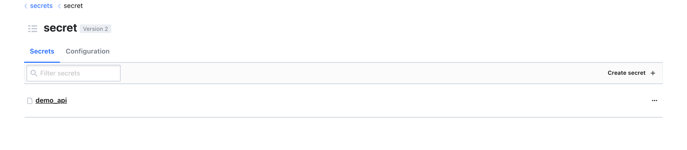
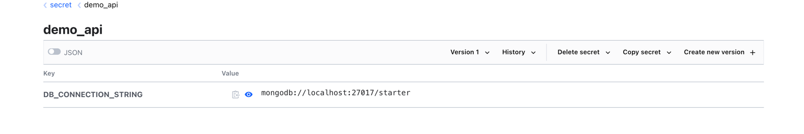

<p align="center">
  <a href="http://nestjs.com/" target="blank"></a>
</p>

# REST API Template with NestJS, MongoDB, Redis, and HashiCorp Vault

## Introduction

This project is a REST API template built using NestJS. It utilizes MongoDB for the database, Redis for caching, and HashiCorp Vault for secure secrets management. The project is containerized using Docker and orchestrated with Docker Compose to ensure easy setup and consistent running environments.

## Prerequisites

Before you begin, ensure you have the following installed:
- Docker
- Docker Compose

## Setup and Installation

### Running the Services

1. **Start the Services**: Run the following command to start all components (MongoDB, Redis, HashiCorp Vault) locally:
    ```bash
    docker-compose up -d
    ```

2. **Access HashiCorp Vault**:
    - Once `docker-compose` has completed, open your browser and navigate to `http://localhost:8200`.
    - Log in using the token defined in the `docker-compose.yml` file, which in our case it myroot.

### Configuring HashiCorp Vault

1. **Add a New Secret**:
    - In the Vault UI, navigate to the 'Secrets' section.
    - Add a new KV secret named `demo_api`.
   
    - Within this secret, add a key for the MongoDB connection string named `DB_CONNECTION_STRING`.
    - Add the following value for the connection string:
        ```
        mongodb://mongo:27017
        ```
      

### Running the API

After setting up the Vault, you can start the NestJS application by running:

```bash
npm run start:dev
```

### Add environment variables
In order to start working with the API, you need to add the following environment variables to your `.env` file:
```
VAULT_TOKEN=myroot
VAULT_ADDRESS=http://localhost:8200
VAULT_PREFIX_PATH=secret/data/demo_api
```

In case of changing values, you may also need to update the docker-compose.yml file.

#### Next steps
 - Add support for Redis with fallback to in-memory cache.
 - Base schema with mini repository pattern.
 - Add support for Swagger.
 - Add support for unit testing.
 - Add support for integration testing.
 - Add support for global exception handling.
 - Add support for custom exceptions.
 - Add support for logging.
 - Add support for DTOs to entities mapping.
 - Pulling core to a separate package, such as the Redis module, Database access, etc.
 - Add support for Docker. 
 - Add eslint rules.
 - Add prettier rules.
 - Add support for Git Husky.
 - 
